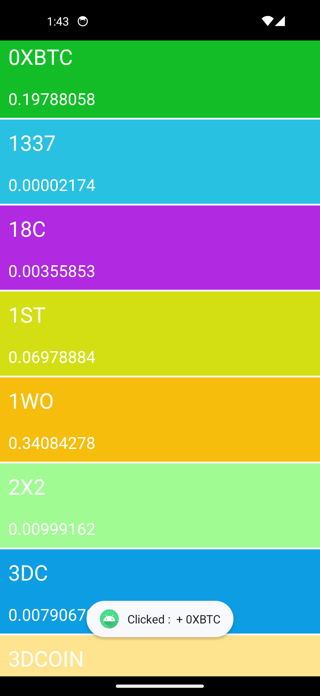
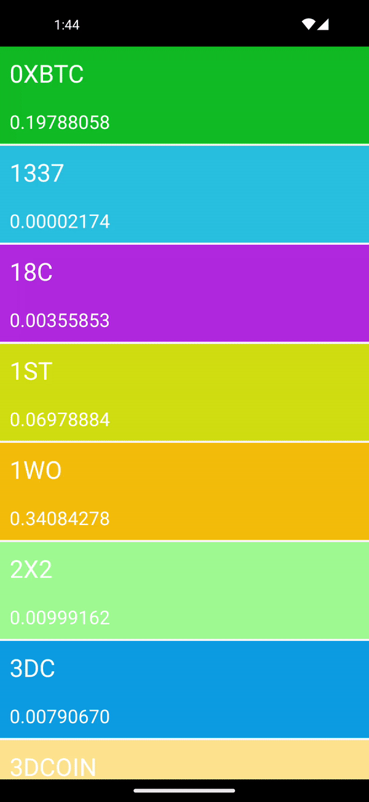
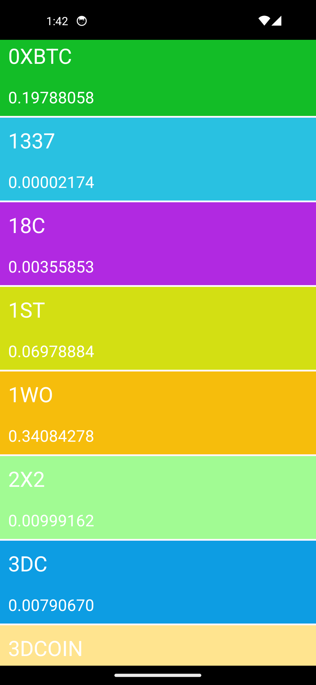

<h1>CryptoRetrofit App</h1>

<p>Bu Android uygulaması, bir JSON dosyasından kripto para verilerini çekerek Retrofit kütüphanesi kullanılarak bir arayüz oluşturur. Veriler RecyclerView ve Retrofit entegrasyonuyla ekranda listelenir.</p>

<h2>Kullanılan Teknolojiler</h2>

<ul>
    <li><a href="https://square.github.io/retrofit/">Retrofit</a>: HTTP istekleri yapmak için kullanılan kütüphane.</li>
    <li><a href="https://developer.android.com/guide/topics/ui/layout/recyclerview">RecyclerView</a>: Veri listelerini görüntülemek için kullanılan Android bileşeni.</li>
    <li><a href="https://github.com/google/gson">Gson</a>: JSON verilerini Java objelerine dönüştürmek için kullanılan kütüphane.</li>
</ul>

<div>
  
  
  
</div>

<h2>Nasıl Kullanılır</h2>

<ol>
    <li>Uygulama başladığında, Retrofit kullanılarak JSON verileri bir network isteğiyle alınır.</li>
    <li>Alınan veriler RecyclerView içinde listelenir.</li>
    <li>Kullanıcı bir kripto para birimine tıkladığında, bir Toast mesajıyla bu kripto para biriminin adı gösterilir.</li>
</ol>

<h2>Örnek Kodlar</h2>

<h3>CryptoAPI Interface</h3>

<pre><code>interface CryptoAPI {
    @GET("atilsamancioglu/K21-JSONDataSet/master/crypto.json")
    fun getData(): Call&lt;List&lt;CryptoModel&gt;&gt;
}
</code></pre>

## Kurulum

Projeyi çalıştırmak için aşağıdaki adımları takip edebilirsiniz:

1. **Depoyu klonlayın**:

    ```shell
    git clone <https://github.com/kberktavli/CryptoRetrofit>
    ```

2. **Projeyi açın**:

    - Android Studio veya tercih ettiğiniz bir IDE'de projeyi açın.

3. **Gerekli paketleri yükleyin**:

    - Proje, gerekli paketleri yüklemek için `gradle` kullanır. İhtiyaç duyulan paketlerin otomatik olarak yüklenmesi için projeyi derleyin.

4. **Uygulamayı başlatın**:

    - Projeyi başlatarak uygulamayı çalıştırabilirsiniz.

## Kurs Kaynağı

Bu proje, [Udemy](https://www.udemy.com/course/android-o-mobil-uygulama-dersi-kotlin-java/) üzerindeki "Android Mobil Uygulama Kursu: Kotlin & Java" adlı kursun içeriğinden esinlenilmiştir. Kursu oluşturan [Atıl Samancıoğlu](https://github.com/atilsamancioglu) tarafından sağlanmıştır.

